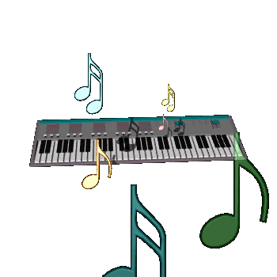

<div align="center">

# 🎨 PCB Designing with KiCad

### *Transforming Circuit Ideas into Professional PCBs*

[](https://www.kicad.org/)
[](LICENSE)
[](https://github.com)


</div>

---

## 📖 About KiCad

**KiCad** is a powerful, free, and open-source Electronic Design Automation (EDA) suite trusted by professionals and hobbyists worldwide. It provides a complete workflow for hardware development:

- 🖊️ **Schematic Design** - Draw and organize complex circuit diagrams
- 🔧 **PCB Layout** - Route multi-layer boards with precision
- 📦 **Manufacturing Files** - Generate Gerber files ready for fabrication
- 🎨 **3D Visualization** - Preview your board before production
- 📚 **Extensive Libraries** - Access thousands of component footprints

Whether you're prototyping a hobby project or developing a commercial product, KiCad equips you with everything needed to bring your electronic designs to life.

---

## 🎹 Featured Projects

### 🎵 Touch Piano

<div align="center">

</div>

A **touch-based musical instrument** powered by a microcontroller that transforms capacitive touch into musical notes.

**Key Features:**
- Touch-sensitive pads with large copper pours
- Microcontroller integration (ATmega/ESP32)
- Piezo speaker output
- Compact, interactive design

**Design Highlights:**
- Careful routing to minimize analog interference
- Strategic component placement using 3D viewer
- Perfect example of interactive electronics prototyping

---

### ⚡ Buck Converter

<div align="center">

</div>

An efficient **DC-DC step-down converter** for voltage regulation in battery-powered applications.

**Key Features:**
- Switching regulator IC with external passives
- Optimized power trace routing
- Thermal relief considerations
- DRC-verified layout

**Design Highlights:**
- Strategic placement of inductors and capacitors
- Noise reduction through proper layout
- Production-ready power supply solution

---

## 🚀 Why KiCad?

<div align="center">

| Feature | Benefit |
|---------|---------|
| 🆓 **Free & Open Source** | No licensing costs, full access to source code |
| 🌍 **Cross-Platform** | Works on Windows, macOS, and Linux |
| 🔄 **Active Development** | Regular updates and community support |
| 🧩 **Plugin Ecosystem** | Extend functionality with custom tools |
| 📐 **Professional Grade** | Used in commercial and industrial applications |

</div>

---

## 💡 Getting Started

1. **Download KiCad** from [kicad.org](https://www.kicad.org/)
2. **Explore the projects** in this repository
3. **Open the `.kicad_pro` files** to view schematics and PCB layouts
4. **Learn and iterate** on your own designs

---

## 📂 Repository Structure

```
📦 PCB-Designs
 ┣ 📁 BUCK CONVERTER FINAL/     # Buck converter project files
 ┣ 📁 piano wkshp/               # Touch piano project files
 ┣ 🖼️ buck.gif                   # Buck converter preview
 ┣ 🖼️ piano.gif                  # Piano project preview
 ┣ 🖼️ intro.gif                  # KiCad introduction
 ┗ 📄 README.md                  # You are here!
```

---

## 🎯 Conclusion

KiCad proves to be an **exceptional tool** for PCB design across diverse electronics projects. From musical instruments to power electronics, it supports the entire workflow with **precision and flexibility**.

This repository showcases real-world applications and demonstrates how **accessible hardware design** has become. Whether you're a beginner or experienced engineer, KiCad helps you transform ideas into professional-grade PCBs with confidence.

---

<div align="center">

### ⭐ Star this repo if you find it helpful!

**Made with ❤️ using KiCad**

</div>
